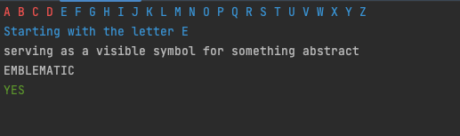
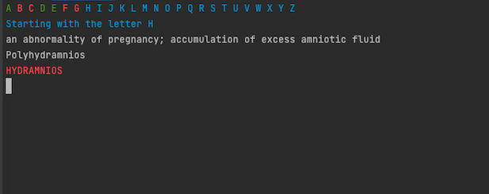

# learnVocabulary

The objective of this game is to learn vocabulary in english and have fun!

To run the game:
- Clone the repo
- Execute `ruby game.rb`
- play!

There is a cleanUp.rb file that was used to improve the data source.

Data Source: https://github.com/tusharlock10/Dictionary

